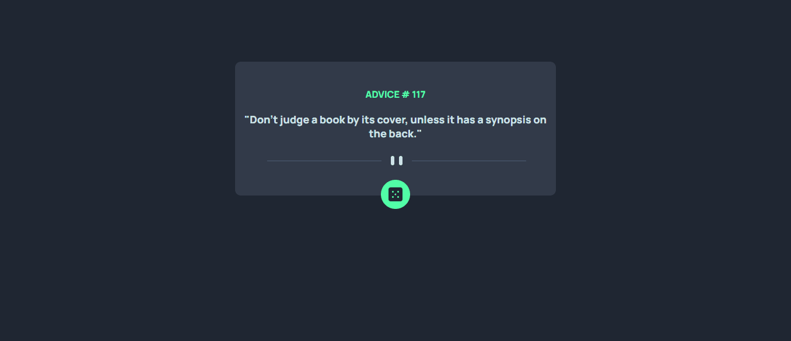

# advice-generator-app
Sistema que gera conselho aleatórios, usando API para que seja possível gerar essas mensagens. Feito com base no desafio do site Front end Mentor. Site que uso para práticar meus conhecimentos. 

## Tecnologias utilizadas
- HTML
- CSS
- JAVASCRIPT (API)